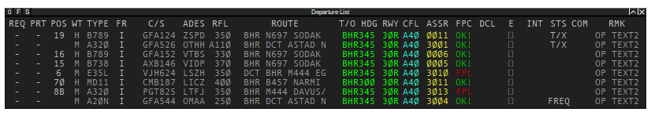
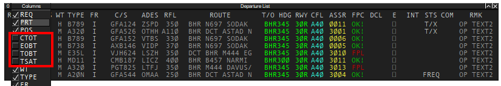

## Airport Collaborative Decision Making (A-CDM)

### Definitions
- **Estimated Off-Block Time (EOBT)** - General estimate as to when an aircraft will be ready to start-up/push-back. Do note that the TOBT is more accurate as it may be updated, whereas the EOBT is static.
- **Target Off-Block Time (EOBT)** - The time that aircraft operators estimate that they will be ready, all doors closed, boarding bridge removed, push-back vehicle available and ready to start-up/push-back immediately upon reception of clearance from ATC.
- **Target Start-Up Time (TSAT)** - Calculated time at which start-up clearance can be expected. TSAT includes all parameters such as calculated take off time (CTOT), variable taxiing time etc.

### Target Start-Up Time (TSAT)
After an aircraft gives confirmation of being ready for pushback, DEL will instruct pilots to monitor GMC at TSAT +/- 2 MIN and standby for further ATC instructions.

### Using CDM

Figure 1.1

- Click on the **F** button to enable variables hidden by default

Figure 1.2

- Select the following functions above, or as briefed during busy events.

Figure 1.3

- Locate the following panel and click on the respective airport to enable CDM as a master user.

!!! note "Important"
    It is vital that **only** DEL, or FMP/Planner if online, should click on the button outlined in Figure 1.3 as it is their responsibility to manage. All other controllers should use the **.cdm slave [ICAO]** command instead.
