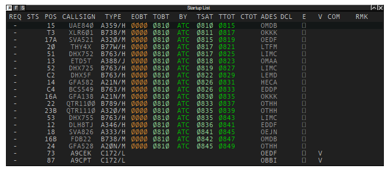

## Airport Collaborative Decision Making (A-CDM)

### Definitions
- **Estimated Off-Block Time (EOBT)** - General estimate as to when an aircraft will be ready to start-up/push-back. Do note that the TOBT is more accurate as it may be updated, whereas the EOBT is static.
- **Target Off-Block Time (TOBT)** - The time that aircraft operators estimate that they will be ready, all doors closed, boarding bridge removed, push-back vehicle available and ready to start-up/push-back immediately upon reception of clearance from ATC.
- **Target Start-Up Time (TSAT)** - Calculated time at which start-up clearance can be expected. TSAT includes all parameters such as calculated take off time (CTOT), variable taxiing time etc.

!!! note "Do note!"
    Pilots **DO** know their **EOBT and TOBT**, they **DON'T** know their **TSAT**!

#### Target Start-Up Time (TSAT)
After an aircraft gives confirmation of being ready for pushback, DEL will instruct pilots to monitor GMC at TSAT +/- 2 MIN and standby for further ATC instructions.

---

### Using CDM

Figure 1.1

- Locate the following panel and click on the respective airport to enable CDM as a master user.

Figure 1.2

- Expand your Start-Up list; it will look like the above. If you do not see the list, open it via **Quick Settings**.
- When CDM is in use, pilots are expected to submit their TOBT via the [VDGS Dashboard](https://vats.im/vdgs)
- A TSAT is automatically generated depending on many factors which try improve the efficiency of the aerodrome. This time must be provided to pilots using the following phraseology:

> DLV Controller: "GFA138, readback correct. Expect push at time 08:30z."

!!! note "Important"
    It is vital that **only** DEL, or FMP/Planner if online, should click on the button outlined in Figure 1.3 as it is their responsibility to manage. All other controllers should use the **.cdm slave [ICAO]** command instead.

---

## Arrival Manager (AMAN)

The Arrival Manager is a tactical resource controllers/flow managers may utilise to help form a sequence during times of increased arrivals.

!!! note "Controllers are always in charge"
    This tool exists to **support** controllers/planners, thus it **shall not** be relied on fully.

  <strong>2.1 - EXAMPLE OF AMAN USAGE</strong> 

