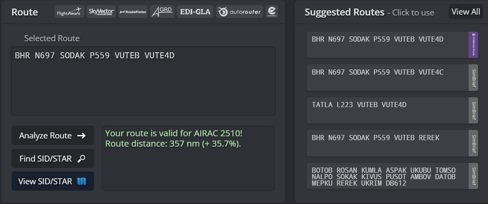
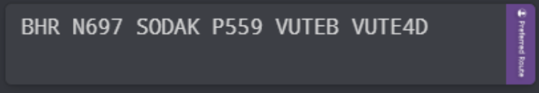

## Standard Routes

Controllers may find the table below with the standard routes departing from **OBBI - Bahrain International Airport** and **OKKK - Kuwait International Airport**. These routes are updated to the latest AIRAC cycle and is available via Simbrief. Controllers should find this page useful to access commonly used routes within the OBBB & OKAC FIR on VATSIM. This page is updated once a new route has been published via Simbrief.

### OMAE FIR

| **Destination** | **Bahrain Standard Route**                      | **Kuwait Standard Route**                                               |
|-----------------|-------------------------------------------------|-------------------------------------------------------------------------|
| OMDB            | BHR N697 SODAK P559 VUTEB                       | SESRU M677 VUTEB                                                        |
| OMSJ            | BHR N697 SODAK P559 KIVUS L305 EMOTA R784 GONVI | SESRU M677 ITBUL L305 EMOTA R784 GONVI                                  |
| OMAA            | BHR N685 UMEVU Q415 UKILI                       | BOXIK B416 IMDOX P975 LONOS P708 OVONA N318 KAPUM Z522 ALNEV Q415 UKILI |

---

### OEJD FIR

| **Destination** | **Bahrain Standard Route**                    | **Kuwait Standard Route**                 |
|-----------------|-----------------------------------------------|-------------------------------------------|
| OEDF            | BHR B457 NARMI                                | ASVIR H741 PUSRA                          |
| OERK            | BHR B457 NARMI N112 GETOT Q212 KIA            | KFR G782 ESRAT                            |
| OEJN            | BHR B457 NARMI N112 GETOT Q212 KIA G782 VEMEM | KFR P517 KSB B417 GAS G674 PMA B544 NOMDA |
| OEMA            | BHR NARMI N697 TAYMA GAS G674 EMURI           | KFR NIDAP L550 BOSID B417 GAS G674 EMURI  |

---

### OOMM FIR

| **Destination** | **Bahrain Standard Route**                                          | **Kuwait Standard Route**                                             |
|-----------------|---------------------------------------------------------------------|-----------------------------------------------------------------------|
| OOMS            | BHR N697 SODAK P559 AMBOV Q322 LOVEM L223 TARDI N629 MUSUK T511 MCT | SESRU M677 OBNET IVOXI ANVIX L223 TARDI N629 MUSUK T511 MCT           |
| OOSA            | ---                                                                 | BOXIK B416 IMDOX P975 LONOS P708 OVONA N318 LAKLU Q204 HAI B400 ASTUN |

---

### OTDF FIR

| **Destination** | **Bahrain Standard Route** | **Kuwait Standard Route**              |
|-----------------|----------------------------|----------------------------------------|
| OTHH            | BHR ASTAD N318 LUBET HAYYA | BOXIK B416 IMDOX P975 LONOS L703 HAYYA |

---

## Accessing Simbrief Routes

Controllers may use Simbrief to access valid routes. These routes are uploaded by the VATMENA Operations Department on Simbrief to ensure pilots file the preferred route. Controllers may also utilise Simbrief in the case where a re-route is required. See figures 1.1 & 1.2 for additional reference. 

Figure 1.1

---

Figure 1.2

The preferred route option is highilighted in the purple color. These routes are uploaded/updated by the VATMENA Operations Department every AIRAC cycle. 