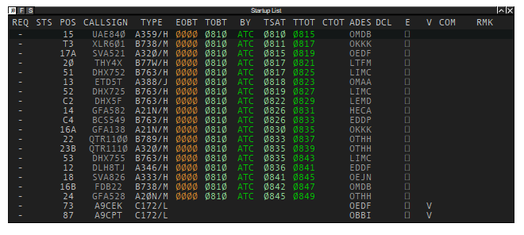

## Airport Collaborative Decision Making (A-CDM)

### Definitions

| Abbreviation      |     Full Form        |               Meaning                   |
|---------------|--------------------------------|---------------------------------------|
|   EOBT  |           *Estimated Off-Block Time                  |       General estimate as to when an aircraft will be ready to start-up/push-back. Do note that the TOBT is more accurate as it is updated by pilots, whereas the EOBT is included in an aircrafts flightplan and is static.                  |
|   TOBT  |           Target Off-Block Time                  |       The time that aircraft operators estimate that they will be ready, all doors closed, boarding bridge removed, push-back vehicle available and ready to start-up/push-back immediately upon reception of clearance from ATC.                  |
|   TSAT  |           Target Start-Up Time                  |       Calculated time at which start-up clearance can be expected. TSAT includes all parameters such as calculated take off time (CTOT), variable taxiing time etc.                  |

!!! note "Do note!"
    Pilots **DO** know their **EOBT and TOBT**, they **DO NOT** know their **TSAT**!

#### Target Start-Up Time (TSAT)
After an aircraft gives confirmation of being ready for pushback, DEL will instruct pilots to monitor GMC at TSAT +/- 2 MIN and standby for further ATC instructions.

---

### Using CDM

Figure 1.1

- Locate the following panel and click on the respective airport to enable CDM as a master user.

Figure 1.2

- When CDM is in use, pilots are expected to submit their TOBT via the [VDGS Dashboard](https://vats.im/vdgs)
- A TSAT is automatically generated depending on many factors which try improve the efficiency of the aerodrome. This time must be provided to pilots using the following phraseology:

> GMP Controller: "QTR138, readback correct. Expect push at time 08:30z."

!!! note "Important"
    It is vital that **only** DEL, or FMP/planner, if online, should click on the button outlined in Figure 1.3 as it is their responsibility to manage. All other controllers should use the **.cdm slave [ICAO]** command instead.