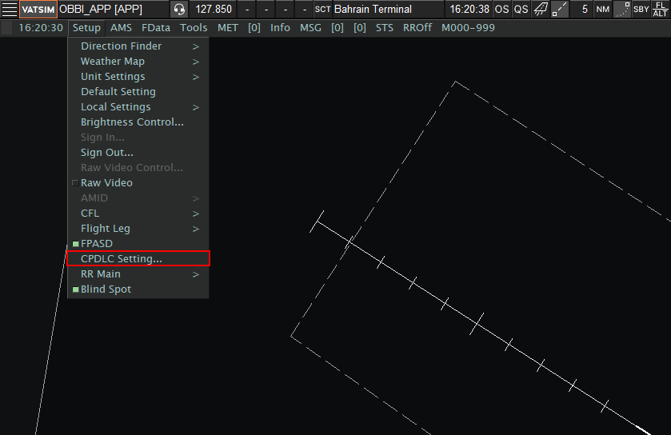
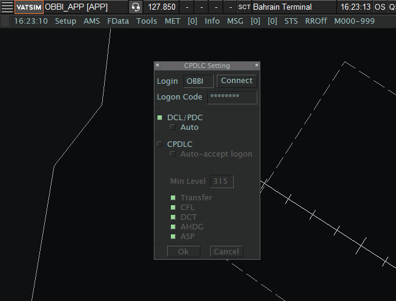

  <iframe src="https://www.youtube.com/embed/MlV7Lu5gzgk?start=1"
          style="position: absolute; top: 0; left: 0; width: 100%; height: 100%;"
          frameborder="0"
          allow="accelerometer; autoplay; clipboard-write; encrypted-media; gyroscope; picture-in-picture"
          allowfullscreen>
  </iframe>

## Setting up DCL/PDC

!!! note "Use of DCL/PDC"
    All controllers **__must__** have DCL/PDC available to use when controlling Hamad Intl. (OTHH) and Bahrain Intl. (OBBI).

Figure 1.1

- Navigate to the Radar View and select **CPDLC Settings** under **Setup** as highlighted above.

Figure 1.2

- Under **Logon Code**, controllers must insert their Hoppie Logon code. If you do not have an account with Hoppie ACARS, please make one [here](https://www.hoppie.nl/acars/system/register.html).
- All controllers APP or below must ensure that **CPDLC** is offline. **Only PDC/DCL should be enabled.**

!!! note "Auto Mode"
    When controlling Bahrain Intl. (OBBI), Auto mode **must** be disabled. This is due to the fact that Bahrain has no published SIDs and a heading must be selected instead.
