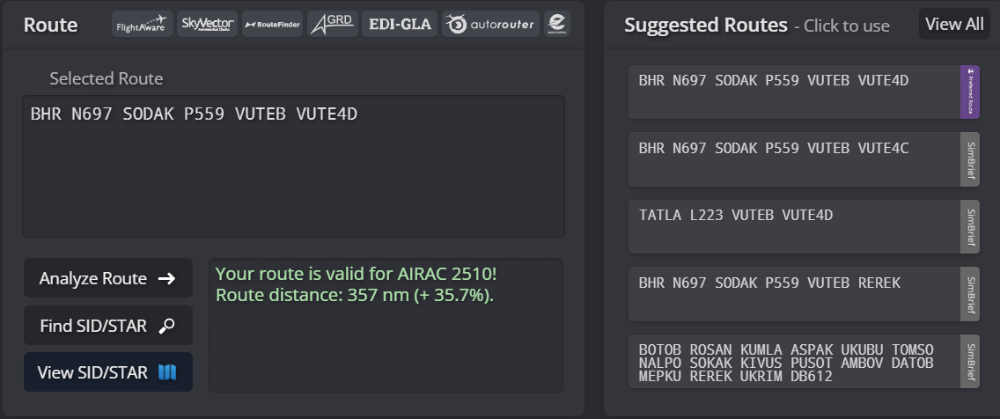

## Standard Routes

Controllers may find the table below with the standard routes departing from **OBBI - Bahrain International Airport** and **OTHH - Hamad International Airport**. These routes are updated to the latest AIRAC cycle and is available via SimBrief. Controllers should find this page useful to access commonly used routes within the OBBB & OTDF FIRs on VATSIM. This page is updated once a new route has been published via SimBrief.

### OMAE FIR

| **Destination** | **Bahrain Standard Route**                      | **Doha Standard Route**                                               |
|-----------------|-------------------------------------------------|-------------------------------------------------------------------------|
| OMDB            | BHR N697 SODAK P559 VUTEB                       | ALSEM L305 ITBUL M677 VUTEB                                                       |
| OMSJ            | BHR N697 SODAK P559 KIVUS L305 EMOTA R784 GONVI | ALSEM L305 EMOTA R784 GONVI                                  |
| OMAA            | BHR ASTAD N318 KAPUM Z522 ALNEV Q415 UKILI      | KUPRO N300 KAXOB Q415 UKILI |

---

### OEJD FIR

| **Destination** | **Bahrain Standard Route**                    | **Doha Standard Route**                   |
|-----------------|-----------------------------------------------|---------------------------------------------|
| OEDF            | BHR B457 NARMI                                | TULUB B457 NARMI                            |
| OERK            | BHR B457 NARMI N112 GETOT Q212 MEMGO          | TULUB B457 NARMI GETOT ESRAT                           |
| OEJN            | BHR B457 NARMI N112 GETOT Q212 KSA M309 VEMEM | TULUB P700 BHR P699 NARMI N112 ULDEG N687 KSA M309 VEMEM |
| OEMA            | BHR B457 NARMI N697 TAYMA GAS G674 EMURI      | TULUB B457 NARMI N697 BPN G674 PMA          |

---

### OOMM FIR

| **Destination** | **Bahrain Standard Route**                                          | **Kuwait Standard Route**                                             |
|-----------------|---------------------------------------------------------------------|-----------------------------------------------------------------------|
| OOMS            | BHR N697 SODAK P559 AMBOV Q322 LOVEM L223 TARDI N629 MUSUK T511 MCT | BUNDU B415 RURAL N685 LAKLU G216 MCT           |
| OOSA            | ---                                                                 | DATRI L564 BAT KUTNA MIGMA GOBRO L425 ITUVO B400 ASTUN |

---

### OKAC FIR

| **Destination** | **Bahrain Standard Route** | **Doha Standard Route**              |
|-----------------|----------------------------|----------------------------------------|
| OTHH            | BHR A453 DEBTI | TULUB B457 BHR A453 DEBTI |

---

## Accessing Simbrief Routes

Controllers may use Simbrief to access valid routes. These routes are uploaded by the VATMENA Operations Department on Simbrief to ensure pilots file the preferred route. Controllers may also utilise Simbrief in the case where a re-route is required. See figures 1.1 & 1.2 for additional reference. 

Figure 1.1

---

Figure 1.2

The preferred route option is highilighted in the purple color. These routes are uploaded/updated by the VATMENA Operations Department every AIRAC cycle. 
