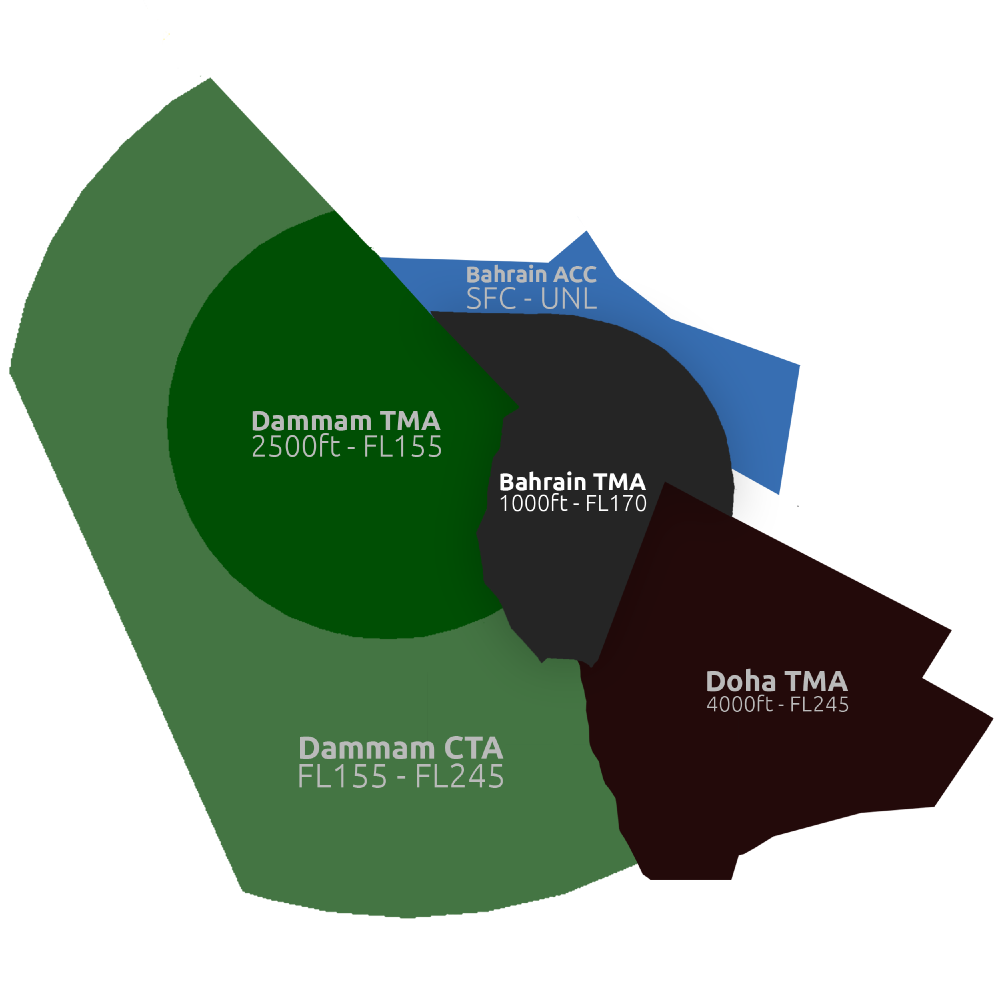

## **Bahrain Approach [OBBI_APP]**

### Amendment History

| **Revision** | **Effective Date** | **Notes**           |
|--------------|--------------------|---------------------|
| Version 1    | 13AUG25            | Initial Publication |
| Version 2    | 30OCT25            | Revision #1         |

----

## Chapter 1. Position Overview 
**Bahrain Approach (APP)** is responsible for providing approach radar control services to aircraft departing, arriving or transiting the **Bahrain Terminal Maneuvering Area (TMA)**. It is also the responsibility of the approach controller to ensure aircraft are separated in accordance with the Standard Operating Procedures outlined in this document, ensure a safe and efficent flow of traffic in and out of the airports covered within the TMA.

**Bahrain Approach (APP)** shall provide surveillance based radar services to all aircraft operating within it's vertical and lateral boundaries to ensure safe separation between aircraft is maintained at all times.

----

## Chapter 2. Airspace
The **Bahrain Terminal Maneuvering Area (TMA)** has a vertical extension up to FL170 and split across 3 different classes at various levels. The Approach Controller is responsible for understanding the differences between these Classes of Airspace. 

The airspace in the **Bahrain Terminal Maneuvering Area (TMA)** doesn't allow for alot of maneuverability due to it's geographical location and multiple surrounding country borders so aircraft need to be carefully managed in order to ensure safe seperation between arrivals and departures. 

|     **Airspace Type**     | **Airspace** | **Class** | **Vertical Limits** | **Controller** |
|:-------------------------:|:------------:|:---------:|:-------------------:|:--------------:|
| Terminal Maneuvering Area |  Bahrain TMA |     D     |   1000ft - 4500ft   |    OBBI_APP    |
| Terminal Maneuvering Area |  Bahrain TMA |     C     |    4500ft - FL150   |    OBBI_APP    |
| Terminal Maneuvering Area |  Bahrain TMA |     A     |    FL150 - FL170    |    OBBI_APP    |

--- 

Table 2.0.1. - Bahrain Terminal Maneuvering Area (TMA)

---

### 2.1 Transition Altitude and Level
The transition altitude and level in Bahrain is consistent with the Gulf Region. 

| **Transition Altitude** | **Transition Level** |
|:-----------------------:|:--------------------:|
|         13000ft         |         FL150        |

The transition layer exists between these two altitudes and is not to be used by controllers or aircraft alike for level flight.

### 2.2 Aerodromes within the Terminal Maneuvering Area (TMA)
The APP Controller is responsbile for **Bahrain International Airport (OBBI)**, **Isa Airbase (OBBS)** and **Sakhir Airbase (OBKH)**

Both Isa and Sakhir Airbase are military airfields to which we do not provide ATC services for on the ground. 

---

### 2.3 Surrounding Airspace 
The **Bahrain Terminal Maneuvering Area (TMA)** is surrounded by both Saudi Arabia to the West and Qatar to the South. As APP Controller in Bahrain you have to work closely with the adjacent controlling units to ensure safe and efficent operations within the TMA. 

Table 2.3.1. - Surrounding Airspace

---

## 2.4 Restricted Airspace
The **Bahrain Terminal Maneuvering Area (TMA)** has 3 **Restricted** sections of Airspace which must not be encroached at any time unless given approval by the APP Controller for operations in/out of **Isa Airbase (OBBS)** or **Sakhir Airbase (OBKH)**. 

**INSERT IMAGE**

| **Restricted Airspace Identifier** | **Vertical Limits** | **Validity** |
|:----------------------------------:|:-------------------:|:------------:|
|               **R57**              |     GND - UNLTD     |   Permanent  |
|               **P42**              |      GND- UNLTD     |   Permanent  |
|               **R66**              |     GND - UNLTD     |   Permanent  |

### 2.5 Area of Responsibility 
The **APP Controller** is responsible for the airspace surrounding Bahrain Airport by the arc of circle radius 40nm centered on the **BHR VHF Omnidirectional Range (VOR).**

Bahrain Approach shall provide surveillance based radar control services to aircraft to which are:

- Released from the ACC Controller descending into the vertical and lateral limits of the Bahrain Terminal Maneuvering Area (TMA). 
- Aircraft Transiting the Bahrain Terminal Maneuvering Area (TMA) until clear of vertical and/or lateral limits of the TMA. 
- Departing Aircraft from one of the aerdromes covered within the TMA until outside of the vertical or lateral limits of the TMA and handed over to the next relevant controller.
- Aircraft coming from uncontrolled airspace into the vertical and lateral limits of the Bahrain Terminal Maneuvering Area (TMA).

----

# Chapter 3. GEN | Standard Operating Procedures 

### 3.1 Separation Requirements 

#### 3.1.1 Longitudinal Separation Requirements 
All aircraft within the **Bahrain Terminal Maneuvering Area (TMA)** must be separated with a **minimum of 5nm longitudinal separation.** 

#### 3.1.2 Vertical Separation 
In the event that longitudinal separation cannot be achieved aircraft must be separated with a **minimum of 1000ft separation.** 

#### 3.1.3 Speed Control 
In order for aircraft to complete any required turns within the **Bahrain Terminal Maneuvering Area (TMA)** and to safely operate within the laterally confined airspace speed control can be issued to aircraft. 

Speed Control can also be utilised to maintain separation between climbing traffic. 

The standard speed restriction below 10,000ft is 250kts.

#### 3.1.4 Wake Turbulence Separation (WTS)
The following **Wake Turbulence Separation (WTS)** shall be applied to aircraft being provided with a Surveillance Based Separation (SBS) which is utilised within the **Bahrain Terminal Maneuvering Area (TMA)**

| **Trailing   Aircraft** | **Behind** | **Leading   Aircraft** | **Distance Separation Minima** |
|:-----------------------:|:----------:|------------------------|-------------------------------|
|        Light (L)        |            |       Medium (M)       |              5nm              |
|        Medium (M)       |            |        Heavy (H)       |              5nm              |
|        Light (L)        |            |        Heavy (H)       |              6nm              |
|        Heavy (H)        |            |        Heavy (H)       |              4nm              |
|        Medium (M)       |            |          A380          |              7nm              |
|        Light (L)        |            |          A380          |              8nm              |

The 5nm longitudinal separation requirements within the TMA **overides any wake turbulence seperation minima which is lower than the minimum longitudinal seperation requirements.** 

### 3.2 Departure Procedures 
**Bahrain Approach (APP)** is responsible for ensuring all aircraft departing the **Bahrain Terminal Maneuvering Area (TMA)** are safely separated vertically and/or laterally before being handed off to the next controller. All aircraft must be cleared onto their filed airway before being handed off to the next controller. 

#### 3.2.1 Inital Contact 
Upon initial contact with a departing aircraft after being handed over from the **TWR Controller** aircraft should report the following information. 

- Callsign
- Heading 
- Passing Altitude 

If an aircraft does not report their passing altitude on initial contact it must be requested from the pilot in order to verify radar contact and cross check that they are showing the correct altitude on radar. 
This can be within a 300ft +/- range of their reported passing altitude. 

> **APP Controller:** _**"GFA505, Reporting your passing altitude"**_

Once you have confirmed their passing altitude against the altitude showing on radar you can confirm they're identifed on radar and proceed to clear them as necessary.

> **APP Controller:** _**"GFA505, Identified passing altitude 1500ft, continue climb FL170, resume own navigation direct MEDMA"**_

#### 3.2.2 Climb Restrictions 
Various flights have climb restrictions due to various operational factors. These restrictions must be upheld at all times. 

| **Destination** | **Maximum Authorised Climb from APP** | **Maximum Filed Level** |
|:---------------:|:-------------------------------------:|:-----------------------:|
|       OEDF      |                 6000ft                |          6000ft         |
|       OT*       |                11000ft                |         11000ft         |
|       OE**      |                 12000ft               |          Unlimited      |
|       OM*       |                 FL170                 |          FL250          |
|       OKKK      |                 FL170                 |          FL260          |

!!!node "**Letter of Agreement (LOAs)**"
    Please ensure you have read and understood all Letter of Agreements before controlling on the Network.

The **Approach Controller** should climb aircraft as per the above table ensuring vertical and lateral separation is maintained between all aircraft operating within the **Bahrain Terminal Maneuvering Area (TMA)**.

#### 3.2.3 Transitioning Aircraft to the Airways 
Due to the lack of **Standard Instrument Departures (SIDs)** out of Bahrain or any of the aerodromes that fall under the responsibility of the Approach Controller is essential the controller has a full understanding of the airspace structure that is within his area of responsibility. 

The Controller must succesfully transition and guide aircraft from the narrow confinements of the **Terminal Maneuvering Area (TMA)** in a controlled and separated manner onto their filed flight plan route before being handed off to the next controller. 
Approach Controllers should always have a plan of action before aircraft come into their airspace and understand their order of sequence at all times in order to avoid a loss of separation. 

Aircraft will initially come to the Approach Controller on one of the initial headings assigned from the DLV Controller, the **APP Controller** will either provide the aircraft with additional vectors towards the aircrafts planned airway or provide them with a direct to a fix to join the airway system into the en route environment.

Aircraft that are flying on an assigned heading vs aircraft that are flying on their filed routing are delivered instructions differently. 

**Example for giving a direct to an Aircraft Flying an Assigned Heading:**

> **"APP Controller:"** _**"GFA071, resume own navigation direct SODAK"**_ 

**Example for giving a direct to an Aircraft Flying their filed routing:**

> **APP Controller:"** _**"GFA071, route direct SODAK"**_

#### 3.2.4 Handing Aircraft Off 
Due to the location of Bahrain and direction of some flights not all aircraft will be handed off to the en-route controller as they will not enter their airspace. 
Some flights will be handed off to adjacent approach units or en-route positions. 

The **Approach Controller** should be aware of which controller an aircraft needs handed over to based on the lateral and vertical confinements of his airspace and the adjacent unit.

| **Radio Callsign** | **Logon Callsign** | **Abbreviation** | **Frequency** |
|:------------------:|:------------------:|:----------------:|:-------------:|
|    Bahrain Tower   |      OBBI_TWR      |        TWR       |    118.500    |
|   Dammam Approach  |      OEDF_L_APP    |       APP L      |    126.100    |
|   Dammam Approach  |      OEDF_APP      |       APP 1      |    126.300    |
|     Doha Radar     |     DOH_R1_APP     |       RDR N      |    121.100    |
|    Bahrain Radar   |     OBBB_CL_CTR    |        ACC       |    122.300    |
|    Bahrain Radar   |     OBBB_1_CTR     |        ACC       |    127.525    |
|     Doha Control   |     OTDF_1_CTR     |       ACC N      |    135.725    |
|   Jeddah Control   |     OEJD_1_CTR     |       ACC 1      |    126.500    |

### 3.2 Arrival Procedures 
**Bahrain Approach (APP)** is responsible for ensuring all aircraft arriving into the **Bahrain Terminal Maneuvering Area (TMA)** are safely separated vertically and laterally before being handed off to the TWR Controller on final approach. 
All aircraft shall be sequenced within the limitations listed within Section 3.1 of this document. 

#### 3.2.1 Standard Terminal Arrival Routes (STAR) 
Bahrain offers 3 different **Standard Terminal Arrival Routes (STAR)** which are to be assigned to aircraft entering the **Bahrain Terminal Maneuvering Area (TMA)** these will either be assigned by the En-Route Controller however in the absence of an En-Route Controller these should be assigned by the Approach Controller on initial contact with the pilot. 

**Standard Terminal Arrival Routes (STAR)** are assigned based on the arrival routing of the aircraft, typically the last waypoint in an aircrafts Flight Plan (FPL) will be the first waypoint of the **Standard Terminal Arrival Route (STAR)**. 

For example an aircraft arriving from the North will typically have **KOBOK** as the last waypoint in their Flight Plan (FPL), this aircraft would then be assigned the **KOBOK1** arrival. 

**Standard Terminal Arrival Routes (STAR)** are designed to efficently and effectively bring aircraft from the en route environment down in the busy **Terminal Maneuvering Areas (TMA)** surrounding major airports. It is the responsibility of the Approach Controller to ensure aircraft are effectively managed on the Standard Terminal Arrival Routes (STAR) and sequenced for final approach before being handed off to the TWR Controller. 

All **Standard Terminal Arrival Routes (STAR)** arriving into Bahrain are RNAV (Area Navigation) which require an aircraft to be equipped with specific onboard equipment in order to be able to follow the arrival routing to a certain degree of accuracy. All RNAV Arrivals into the Bahrain are RNAV1 which means aircraft must be able to maintain a total system error of no more than 1 nautical mile (NM) for 95% of the flight time. 

If an aircraft is not equipped with sufficent equipment required to fly an RNAV1 arrival or are experiencing GPS Jamming/Spoofing they must inform the **Approach Controller** that they are unable to fly the assigned STAR they should then be issued vectors for the arrival and the **Standard Terminal Arrival Route (STAR)** cancelled.

#### 3.2.1.1 KOBOK ONE RNAV ARRIVAL (KOBOK1)
This **Standard Terminal Arrival Route (STAR)** is designed to bring aircraft arriving from the North West into the **Terminal Maneuvering Area (TMA)** and is suitable for both RWY12L/30R. Aircraft will be expected to maintain altitude until cleared for the approach. As stated in Section 3.2.1 it is the responsibility of the Approach Controller to ensure traffic is managed effectively on all Standard Terminal Arrival Routings (STAR). 

| **Waypoint** | **Recommended Speed Restriction** | **Altitude Range** |
|:------------:|:---------------------------------:|:------------------:|
|     KOBOK    |          230kts - 250kts          |       12000ft      |
|     ELELO    |          220kts - 230kts          |  8000ft - 10000ft  |
|     OBSAS    |               210kts              |       8000ft       |
|     RIGAG    |               210kts              |   5000ft - 7000ft  |
|     NAGAT    |               190kts              |       4000ft       |
|     ALRAS    |               190kts              |       4000ft       |

Once the aircraft reaches NAGAT or ALRAS they should be assigned either a heading to leave each respective fix on either for base turn or to extend the downwind leg further for separation. 

#### 3.2.1.2 LADNA ONE RNAV ARRIVAL (LADNA1)
This **Standard Terminal Arrival Route (STAR)** is designed to bring aircraft arriving from the West into the **Terminal Maneuvering Area (TMA)** and is suitable for both RWY12L/30R. Aircraft will be expected to maintain altitude until cleared for the approach. As stated in Section 3.2.1 it is the responsibility of the Approach Controller to ensure traffic is managed effectively on all Standard Terminal Arrival Routings (STAR). 

| **Waypoint** | **Recommended Speed Restriction** | **Altitude Range** |
|:------------:|:---------------------------------:|:------------------:|
|     LADNA    |               210kts              |       9000ft       |
|     ELELO    |               210kts              |   8000ft - 9000ft  |
|     OBSAS    |               210kts              |       8000ft       |
|     RIGAG    |               210kts              |   5000ft - 7000ft  |
|     NAGAT    |               190kts              |       4000ft       |
|     ALRAS    |               190kts              |       4000ft       |

Once the aircraft reaches NAGAT or ALRAS they should be assigned either a heading to leave each respective fix on either for base turn or to extend the downwind leg further for separation. 

#### 3.2.1.3 ORDIG ONE RNAV ARRIVAL (ORDIG1) 
This **Standard Terminal Arrival Route (STAR)** is designed to bring aircraft arriving from the North East into the **Terminal Maneuvering Area (TMA)** and is suitable for both RWY12L/30R. Aircraft will be expected to maintain altitude until cleared for the approach. As stated in Section 3.2.1 it is the responsibility of the Approach Controller to ensure traffic is managed effectively on all Standard Terminal Arrival Routings (STAR). 

| **Waypoint** | **Recommended Speed Restriction** | **Altitude Range** |
|:------------:|:---------------------------------:|:------------------:|
|     ORDIG    |          230kts - 250kts          |       12000ft      |
|     LOVAK    |          210kts - 230kts          |  9000ft - 10000ft  |
|     OBSAS    |               210kts              |       8000ft       |
|     RIGAG    |               210kts              |   5000ft - 7000ft  |
|     NAGAT    |               190kts              |       4000ft       |
|     ALRAS    |               190kts              |       4000ft       |

Once the aircraft reaches NAGAT or ALRAS they should be assigned either a heading to leave each respective fix on either for base turn or to extend the downwind leg further for separation. 

!!!node "Charts"
    It is the responsibility of the Approach Controller to have a complete and full understanding of all the Standard Terminal Arrival Routes (STAR) into Bahrain and know the limitations of each. 

#### 3.2.2 Initial Contact 
Aircraft arriving into the **Bahrain Terminal Maneuvering Area (TMA)** are to be provided with a set of instructions which will allow the aircraft to fly an assigned routing, descend in a manner which will keep them separated from other traffic and under a controlled speed to ensure traffic is sequenced into the TMA efficently. 

Upon initial contact the **Approach Controller** should provide a pilot with the following information in the event the **ACC Controller** above them is not online: 

- **The Assigned Standard Terminal Arrival Route (STAR)**
- **The Approach Aid in which they will use to land at the airport along with the active runway**
- **An altitude to which to descend to if necessary**
- **Local Pressure at the Airfield of Arrival**

> **APP Controller:** _**"DHX268, Identified, Cleared the ORDIG1 Arrival, ILS Approach Runway 30R, descend altitude 8000ft, QNH 1010"**_

If the **ACC Controller** is online and they're arriving from the Bahrain En-Route Environment then Bahrain Radar will provide them with their expected **Standard Terminal Arrival Route (STAR)**. 
However, the ACC Controller will only tell the aircraft to "expect" a particular STAR. It is still the responsibility of the **Approach Controller** to clear the aircraft onto a particular STAR. 

!!!node "Identifing Aircraft" 
    Remember it is the responsibility of the Approach Controller to ensure all aircraft are identified on initial contact, aircraft should be assigned an individual squawk code if not already and squawking mode 'Charlie' which provides altitude information. 

#### 3.2.3 Sequencing Aircraft
All aircraft entering the **Bahrain Terminal Maneuvering Area (TMA)** should be sequenced in order to ensure separation is always maintained, it is wholly the responsibility of the **APP Controller** to have a plan for all aircraft and know their position in sequence. This can be achieved by ensuring aircraft are under speed control and descending in a controlled manner in accordance with the **Standard Terminal Arrival Route (STAR)**. 

The **APP Controller** should always have a clear plan of action when controlling and keep things as uniform as possible, this will ensure a constant steady flow of arriving traffic whilst ensuring all traffic are safely separated. 

#### 3.2.4 Holding 
If at any point the controller is unable to manage the traffic load within the **Bahrain Terminal Maneuvering Area (TMA)** it is their responsibility to place aircraft into the hold until traffic can once again be sequenced for an approach to the runway. 

Within the **Bahrain Terminal Maneuvering Area (TMA)** there are 6 published holding procedures and they are as follows: 

| **Hold Identifier** | **Vertical Limits** | **Inbound Holding Course** | **Maximum Holding Speed** | **Turn Direction** |
|:-------------------:|:-------------------:|:--------------------------:|---------------------------|--------------------|
|        OBSAS        |   3000ft - 13000ft  |            207°            |           240kts          |        Right       |
|        ALRAS        |   3000ft - 13000ft  |            300°            |           210kts          |        Right       |
|        NAGAT        |   3000ft - 13000ft  |            120°            |           210kts          |        Left        |
|        MARWA        |    5000ft - FL150   |            302°            |           240kts          |        Left        |
|        RAZAN        |    5000ft - FL150   |            122°            |           240kts          |        Right       |
|      BHR (VOR)      |   25000ft - FL170   |          _Various_         |         _Various_         |      _Various_     |

It is imperative that the **APP Controller** fully understands the standard procedures of each of the above holding patterns within the **Bahrain Terminal Maneuvering Area (TMA)**. 
This should include the vertical limits, inbound holding courses, maximum holding speed and the direction of turns they can expect aircraft to carry out if entered into one of the published holds. 

If it is required to put an aircraft in one of the above holds the following phraseology should be used. 

> **APP Controller:** _**"GFA164, enter the published hold at OBSAS, descend altitude 8000ft, speed 230kts, expect 10 minute delay"**_

Aircraft will have published holds within their aircrafts AIRAC cycle uploaded into their FMC by standard. However, in the event they do not you will be required to provide the aircraft with the full requirements to carry out the hold procedure. 

> **APP Controller:** _**"GFA164, enter the hold at OBSAS, inbound holding course 207°, descend altitude 8000ft, speed 230kts, right hand turns, you can expect 10 minute delay"**_

When the situation within the **Bahrain Terminal Maneuvering Area (TMA)** has become managed and you can now accept aircraft for final approach you wil have to sequence aircraft appropiately from the hold. 
If the aircraft is still on his **Standard Terminal Arrival Route (STAR)** you can issue him with a standard clearance. 

> **APP Controller:** _**GFA164, on completion of this pattern, cancel the hold, descend altitude 4000ft via the STAR, speed 210kts"**_ 

If the controller deems it necessary they can cancel the hold by issuing radar vectors for the approach, this can be done by doing the following: 

> **APP Controller:** _**GFA164, cancel the hold, turn right heading 120°, descend altitude 4000ft, speed 210kts"**_

#### 3.2.4.1 Holding Altitudes  
If placing aircraft in the hold they must always as per Section 3.1 remain vertically separated by 1000ft. When placing multiple aircraft into the same holding pattern they can not all hold at the same altitude so the **APP Controller** is responsible for ensuring each aircraft has it's own block altitude within the holding pattern. 

For instance, the 1st aircraft would enter the hold at 8000ft, 2nd aircraft would enter the hold at 9000ft, 3rd aircraft would enter the hold at 10000ft and so and so forth. 

When the requirement for the hold is no longer required, the aircraft at the bottom of the hold will be given instruction to exit first whether that be by radar vectors or to carry on with the published **Standard Terminal Arrival (STAR)**, this will then allow the 2nd aircraft within the holding pattern to descend to the block altitude within the holding pattern that the previous aircraft held. 

The **APP Controller** will continue to descend aircraft in the holding pattern until it is there time to leave the hold. 

### 3.2.5 Approach Aids 
Bahrain offers 3 different types of approach aids to landing aircraft. It is important the **APP Controller** fully understands the different types of approach aids and their capabilities. 

- Instrument Landing System (ILS) 
- VHF Omnidirectional Range (VOR) 
- Required Navigation Performance (RNP) 

#### 3.2.5.1 Precision Approach 
A precision approach is an approach that offers both **Lateral** and **Vertical** guidance to the runway, this is typically an **Instrument Landing System (ILS)**. 

#### 3.2.5.2 Non Precision Approach 
A non precision approach is an approach that offers **lateral** guidance to the runway but not **vertical** guidance. There are various different types of approaches which are deemed non precision. The ones available in Bahrain are: 

- VHF Omnidirectional Range (VOR)
- Required Navigation Performance (RNP) 

!!!node "GPS/RNP Approaches"
    Despite having the ability to provide aircraft with vertical guidance RNP Approaches are still technically deemed non precision this is due their reliance on satellite to provide lateral and vertical guidance. 

Both RWY12L/30R offer the same types of approaches, the standard approach type to be made in Bahrain will be the **Instrument Landing System (ILS)** however in the event the ILS is not functioning or the pilot wants to request an approach utilising one of the non precision approaches available at Bahrain this can be approved, traffic level dependant. 

### 3.2.6 Final Approach  
It is the responsibility of the **APP Controller** to transition aircraft from the **Standard Terminal Arrival Route (STAR)** to the final approach phase. 
This is achieved by vectoring the aircraft from the last way point on the STAR for the base leg turn then onto an intercepting heading for assigned approach aid. 

#### 3.2.6.1 Vectoring for ILS Approaches 
For aircraft flying the ILS approach to either RWY12L or RWY30R they will be given an intercepting vector from the **APP Controller** to intercept the localiser which provides the aircraft with lateral guidance. 

Aircraft should be given a vector within 30 degrees of the final approach course for the runway. The absolute maximum intercept vector for the localiser should be no more than 40 degrees. 

Example:

> **APP Controller:** _**"DHX268, turn right heading 270 degrees, descend altitude 1500ft, cleared ILS Approach RWY30R, report established"**_ 

#### 3.2.6.2 Clearing Aircraft for RNP Approaches 
Aircraft flying the **Required Navigation Performance (RNP)** approach will be cleared via the **Initial Approach Fix (IAF)** to execute the approach. 
The aircraft should be cleared to proceed direct to either the **Initial Approach Fix (IAF)** or the **Intermediate Fix (IF)**. 

Example: 

> **APP Controller:** _**"DHX268, proceed direct LOVAL, descend altitude 2500ft, via LOVAL, you are cleared the RNP Approach RWY12L, report established on the final approach track, QNH1003."**_

!!!node "Differences" 
    As the RNP is not a precision approach, aircraft should be told to report final instead of report established. 

#### 3.2.6.3 Clearing Aircraft for the VOR Approach 
For an aircraft electing the fly the **VHF Omnidirectional Range (VOR)** approach this can either be done by the aircraft flying the full procedural which involves overflying the BHR VOR and performing the 'tear drop' procedure. 
This procedure will involve the aircraft intercepting an outbound radial from the BHR VOR based on aircraft catergory until a specified distance listed on the approach chart and then turning to intercept an inbound radial which will establish the aircraft on final approach and provide lateral guidance to the aircraft. 

You can also provide an aircraft with vectors to intercept the inbound radial for final approach, this will prevent the aircraft from having to fly the full procedural VOR/DME approach. 

##### 3.2.6.3.1 Procedural VOR Approach Clearance 

> **APP Controller:** _**"GFA013, via the BHR VOR you are cleared the procedural VOR/DME approach RWY12L, report on the outbound radial, descend altitude 2500ft, QNH 1003."**_

Once the aircraft reaches the specified distance on the outbound radial they will begin their turn to intercept the inbound final approach radial. 

> **APP Controller:** _**"GFA013, report established on the inbound radial RWY12L"**_

##### 3.2.6.3.2 Vectors for VOR Approach Clearance

> **APP Controller:** _**"GFA013, turn right heading 150 degrees, descend altitude 1500ft, you are cleared the VOR approach RWY12L, report established on the inbound radial, QNH1003."**_

!!!node "Traffic Load"
    The APP Controller must not accept non standard approach requests if the traffic situation in the TMA does not allow.

#### 3.2.6.4 Visual Approach 
Aircraft wishing to conduct a visual approach must be able to maintain visual contact with the runway at all times once cleared for the visual approach. It is the responsibility of the **APP Controller** to position the aircraft to a point in which visual contact can be maintained before clearing the aircraft. 

Visual Meteorological Conditions (VMC) conditions must exist for an aircraft to request a visual approach. Ceiling height must be greater than 1500ft and ground visibility must be greater than 5KM. 

The **APP Controller** can not issue a visual approach clearance, it must be requested from the pilot. 

> **APP Controller:** _**"GFA771, report you have the airfield in sight?"**_ 

Once the aircraft has confirmed they have the airfield in sight the can then be issued with a visual approach clearance. 

> **APP Controller:** _**"GFA771, cleared the visual approach RWY30R, QNH1003"**_ 

Once they have acknowledged they are cleared for the visual approach they should be handed straight to the **TWR Controller**. If TWR is not online, the approach controller should tell the aircraft to report final. 

### 3.3 Tag Management 
It is the responsibility of the **APP Controller** to ensure aircraft tags are managed correctly and promptly upon giving instructions. 
This is to ensure all surrounding controlling units are aware of the planned intentions of each aircraft and to ensure correct management of aircraft within the TMA. 

This includes ensuring altitudes and flight levels are correctly set in accordance with instructions the aircraft has received, any headings or directs the aircraft has been given must be updated accordingly in the aircraft tag and all assigned speeds must be set. 

