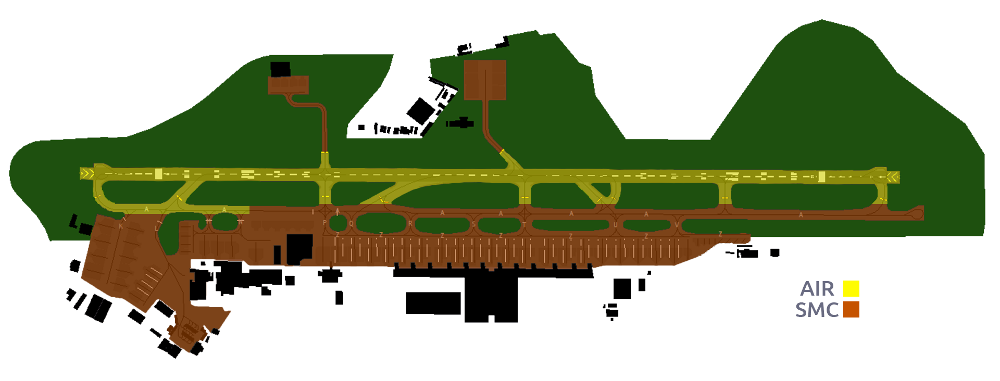

## **Bahrain Ground [OBBI_GND]**

### Amendment History

| **Revision** | **Effective Date** |      **Notes**      |
|:------------:|:------------------:|:-------------------:|
|   Version 1  |       13AUG25      | Initial Publication |

----

## Chapter 1. Position Overview 
**Bahrain Ground (SMC)** is responsible for the movement of aircraft on the airfields aprons and taxiways. The SMC Controller will provide aircraft with pushback instructions when required. Departing Aircraft will then be taxied to the applicable runway holding point and handed off to the TWR Controller as early as possible and clear of any potential ground conflicts. Arriving aircraft will be taxied to a stand on an appropiate apron. 

In the absence of the DLV Controller the SMC Controller will take on those roles and responsibilities.

---

  <strong>1.1 - AREA OF RESPONSIBILITY (30R Config)</strong> 

  <strong>1.1 - AREA OF RESPONSIBILITY (12L Config)</strong> 

----

## Chapter 2. GEN | General Operating Procedures 

### 2.1 Pushback Clearance 
The **SMC Controller** is responsible for providing departing aircraft with a push back clearance. Prior to issuing a push back clearance the aircraft would have correctly set their assigned squawk code. Push back clearance must include the stand number of the aircraft being given clearance. This is method is to ensure other nearby aircraft are aware of the movement from the stand onto a live taxiway. The **QNH must be provided** on the pushback clearance as well. 

Example:

> **SMC Controller:** _**"GFA250, stand 22, push and start approved facing west on on Taxiway Zulu, QNH1022"**_

Once the push back clearance has been issued the **SMC Controller** should ensure they update the tag to provide all controllers with additional situational awareness. 

Pushback clearances must only be issued when it is safe to do so and the area into which the aircraft has been cleared to push to is clear of all obstructions. 

#### 2.1.1 Conditional Pushback Clearance 
In some cases you may have an inbound aircraft taxiing to a stand on the apron which passes behind the aircraft on stand requesting push back and start. In order to ensure a constant flow of traffic the **SMC Controller** can provide the aircraft requesting push back and start with a **Conditional Pushback Clearance**. 

Example:

> **SMC Controller:** _**"GFA250, behind the Emirates Airbus A350 taxiing from your right to left, Stand 22, push and start is approved facing west on Taxiway Zulu, QNH 1022."**_

#### 2.1.2 Simulataneous Pushback Operations
**Simulataneous Pushback Operations** can be conducted at Bahrain. The aim of this process is that once both aircraft have completed their pushback procedures, they will be be in position on the active taxiway with at least one stand between them. 
If aircraft are on adjacent stands and both requesting push back and start it is best practice to have each aircraft push in opposite directions to ensure no ground collision will take place. 

### 2.2 Taxi Procedures 

#### 2.2.1 Departure Taxi Procedures 
Once an aircraft has sucessfully completed their push back and start they will request taxi to the departing runway. It is the responsibility of the **SMC Controller** to provide that aircraft with a safe and efficent taxi instruction from the apron to the departure runway holding point. 

##### 2.2.1.1 RWY30R Departure Configuration
Aircraft will be taxied out from their respective apron at the most convenient point to enter taxiway 'A' to depart full length from holding point A9 for RWY30R. If requested by the pilot and traffic permitting intersection departures can be offered to reduce taxi times.

Example:

> **SMC Controller:** _**"GFA500, taxi to holding point A9 runway 30R, via Zulu, Tango and Alpha."**_

!!!node "Be Helpful"
    Some pilots may require assistance taxing around the airfield, you can provide them with progressive taxi instructions if needed. 

##### 2.2.1.2 RWY12L Departure Configuration
Aircraft will be taxied out from their respective apron at the most convenient point to enter taxiway 'A' to depart full length from holding point A1 for RWY12L. If requested by the pilot and traffic permitting intersection departures can be offered to reduce taxi times. 

> **SMC Controller:** _**"GFA500, taxi to holding point A1 runway 12L, via Zulu, Tango and Alpha."**_

### 2.2.2 Intersection Departures
Intersection Departures can be utilised when the pilot requests it specifically. The SMC Controller is not allowed to to instruct an intersection departure to a pilot without it being requested. 

| **Runway** | **Intersection** |
|:----------:|:----------------:|
|     30R    |        A8        |
|     12L    |        A2        |

### 2.2.3 Northside Aprons 
Aircraft parked on either the Northern Apron or the Texel Apron on the North Side of the airport will be expected to be taxiied to B1 or B2, then transferred to the TWR controller for runway crossing. 
Once they have succesfully been taxiied from the North Side to the South Side and crossed the active runway they will be handed back to the SMC Controller to be taxiied to the active runway for departure.

> **SMC Controller:** _**"CNV1222, taxi to holding point B2 RWY30R via B for crossing."**_

Once the aircraft has reached the designated holding point for runway crossing they will be handed over to the **TWR Controller** who will then slot them in appropiately to cross the runway

> **SMC Controller:** _**"CNV1222, contact Bahrain Tower 118.500 for crossing."**_

Once the **TWR Controller** has sucessfully got the aircraft across the active runway they will be handed back to the **SMC Controller** who will then taxi them to the appropiate runway holding point.

### 2.2.4 Arrival Taxi Procedures 

| **Runway** | **Preferred Vacate Point** |
|:----------:|:--------------------------:|
|     30R    |             A4             |
|     12L    |             A6             |

#### 2.2.4.1 RWY30R Arrival Configuration
Aircraft landing on RWY30R will be expected to vacate the runway at A4, TWR will not immediately hand over the aircraft to the SMC Controller to prevent aircraft holding after vacating and potentially blocking the preferential exit point further leading to the runway being obstructed. Aircraft will initially be told to taxi onto taxiway 'A' by the TWR Controller and then to contact the SMC Controller. It is vitally important that the SMC Controller ensures a stand has been allocated when the aircraft is on final approach so the TWR can see whether the inbound aircraft shall vacate the runway and turn right or left onto taxiway 'A'. 

Once the aircraft has been transferred to the SMC Controller by TWR it is then the responsibility of the SMC Controller to safely and efficently move the aircraft from the taxiway to his assigned stand taken into consideration the situation on the ground.

!!!node "Not Approved"

    Aircraft landing on RWY30R shall not vacate via A6 and/or A7.

> **SMC Controller:** _**"GFA567, welcome to Bahrain, taxi via Quebec and Zulu Stand 13."**_

#### 2.2.4.2 RWY12L Arrival Configuration
Aircraft landing on RWY12L will be expected to vacate the runway at A6, TWR will not immediately hand over the aircraft to the SMC Controller to prevent aircraft holding after vacating and potentially blocking the preferential exit point further leading to the runway being obstructed. Aircraft will initially be told to taxi onto taxiway 'A' by the TWR Controller and then to contact the SMC Controller. It is vitally important that the SMC Controller ensures a stand has been allocated when the aircraft is on final approach so the TWR can see whether the inbound aircraft shall vacate the runway and turn right or left onto taxiway 'A'. 

Once the aircraft has been transferred to the SMC Controller by TWR it is then the responsibility of SMC to safely and efficently move the aircraft from the taxiway to his assigned stand taken into consideration the situation on the ground.

!!!node "Not Approved"

    Aircraft landing on RWY12R shall not vacate via A4

> **SMC Controller:** _**"GFA567, Welcome to Bahrain, taxi via Alpha, Tango and Zulu Stand 19."**_

### 2.2.5 Conditional Taxi Instructions 
In some cases aircraft may require a **Conditional Taxi Instruction** in order to facilitate for other movements on the ground and to ensure the safe movement of aircraft. 

#### 2.2.5.1 Conditional Departure Taxi Instructions 
If the taxi route for a departing aircraft is not clear you can give them a conditional clearance to stop at a certain point along their taxi route to ensure they remain clear of any conflict. 

> **SMC Controller:** _**"DHX265, taxi via Kilo and Alpha hold short of Taxiway Quebec, give way to the arriving Gulf Airbus A321 at Quebec."**_

Once the route has cleared then they can be given the remainder of their taxi instructions as per normal general operating procedures outlined in Chapter 2.2

##### 2.2.5.2 Conditional Arrival Taxi Instructions 
Like before, if an arriving aircraft does not have a clear route to their stand after vacating the runway a conditional clearance can be issued to ensure smooth flow of traffic in and out of the airfield. 
If issuing a conditional arrival taxi instruction you can provide the aircraft with their expected stand number. 

> **SMC Controller:** _**"DHX265, expect Stand 65 taxi via Alpha, hold short of Taxiway Tango, give way to the Gulf Air Airbus A320 exiting the apron at Tango"**_

### 2.3 Low Visibility Procedures (LVPs)
At Bahrain International Airport RWY12L and RWY30R are approved for CAT II operations in the event of LVPs. 

Low Visibility Procedures will be declared when the RVR is reading 1000m or less, or whenever conditions are such that all the maneuvering area is not visible from the control tower.

#### 2.3.1 Low Visibility Procedures - Departures
During LVPs, intersection departures are not authorised for both RWY12L or RWY30R. 

#### 2.3.2 Low Visibility Procedures - Arrivals 
During LVPs, aircraft arriving on RWY12L may only exit the RWY to the South of taxiway A5 or beyond or arriving aircraft may exit to the North at taxiway B1 or taxiway B2. 

### 2.4 Stand Allocation

|     **Apron**     | **Stand Numbers** |            **Airlines**           |
|:-----------------:|:-----------------:|:---------------------------------:|
| Western Apron (A) |      61A - 63     | Non Renevue / Maintenance Flights |
| Western Apron (B) |      50 - 58      |    DHX / TXL / DHK (B767) / BCS   |
|  Executive Apron  |      E1 - E4      |           Buisness Jets           |
|    Cargo Apron    |      C1 - C5      |       DHX / DHK / BOX / BCS       |
|    Middle Apron   |       1 - 6       |    DHK / BOX / General Aviation   |
|   Main Apron (A)  |       1 - 14      |      All Commerical Airlines      |
|   Main Apron (B)  |      15 - 24      |      All Commercial Airlines      |
|   Main Apron (C)  |      25 - 28      |      All Commercial Airlines      |
|   Northern Apron  |      70 - 75      |      US Air Force / RAF / TXL     |
|    Texel Apron    |        N/A        |                TXL                |
