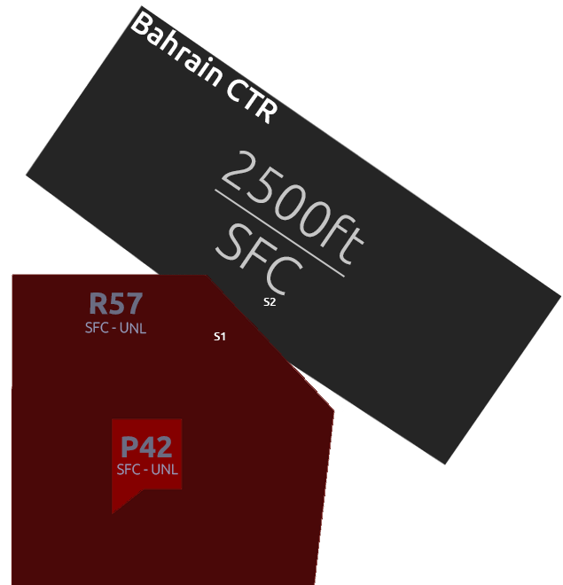

## **Bahrain Tower [OBBI_TWR]**

### Amendment History

| **Revision** | **Effective Date** |      **Notes**      |
|:------------:|:------------------:|:-------------------:|
|   Version 1  |       13AUG25      | Initial Publication |

----

## Chapter 1. Position Overview 
**Bahrain Tower (TWR)** controls movement of aircraft on the runway and holding at all runway holding points. In addition to this the **TWR Controller** also has the responsibility of all aircraft within the **Class D Bahrain Control Zone** and shall ensure separation within the **Control Zone (CTR)** between IFR traffic is maintained for flights arriving and departing Bahrain. Traffic Information is provided between IFR and VFR Flights as well as VFR to IFR Flights within the **Control Zone (CTR)**

The **TWR Controller** is responsible for selecting the active runways for arrivals and departures at Bahrain and holds full authority over the runway.

----

## Chapter 2. Airspace 
The **Bahrain Control Zone (CTR)** is **Class D Airspace** from the Ground up to 2500ft Mean Sea Level (MSL). The **TWR Controller** is responsible for ensuring all traffic within the Control Zone are separated. This will typically include all IFR Flights departing and arriving as well as VFR Flights operating within the Control Zone or entering and exiting. 

Below you can find a top down view of the **Bahrain Control Zone**.

---

---

## Chapter 3. GEN | Standard Operating Procedures

### 3.1 Runway Selection 
At **Bahrain International Airport (OBBI)**, the preferential runway is 30R for departure and arrival which may be utilised with a tailwind of up to 5kts. If the tailwind component is greater than 5kts then runway 12L should be used for arrivals and departures.

!!! tip "References to use!" 
    - You can always refernece real world sources! However, this should NEVER become a reliance. 
    
    - All Controllers should bare the ability to read weather and make an assessment on what the active runway in use should be.

#### 3.1.1 Runway Change
If the **TWR Controller** deems it necessary to change the active runway due to a change in wind direction this should be coordinated with all controllers above and below as this changes departure and arrival clearances. 
This should not be done suddenly, it must be carefully coordinated. The **Approach Controller** and **Tower Controller** will carefully select which aircraft is the last aircraft to land prior to the runway change.

This process is the same with the **DLV or SMC Controller** if an aircraft is already taxing to the active runway prior to runway change it may be less disruptive to allow the aircraft to depart if they can accept the tailwind. 
Aircraft can be re-issued with a departure clearance. 

### 3.2 Line Up Procedures 
The **TWR Controller** must issue clear and precise instructions when issuing aircraft with an instruction to line up on the active runway. There should be no delay and must include the following information: 

- The correct runway designator.
- The Holding Point at which the aircraft is to enter the runway by. 
- Any relevant traffic information. 

Example:

> **TWR Controller:** _**"GFA087, via A9 line up and wait RWY30R"**_ 

#### 3.2.1 Conditional Line Up Clearance (Landing Traffic)
The **TWR Controller** may issue a conditional line up clearance in order to maximise movements and runway efficency. This must be done efficently and precisely. 

Example:

> **TWR Controller:** _**"GFA087, behind the landing Qatar Airbus A320, 3 mile final, line up and wait RWY30R via A9, behind"**_ 

!!!node "Vitally Important" 
    The use of the word "behind" at the start and end of the instruction is compulsory, this is to ensure the aircraft fully understands they are to give way to the landing traffic.

##### 3.2.2 Conditional Line Up Clearance (Departing Traffic) 
The **TWR Controller** can also issue a conditional line up clearance for traffic waiting to depart behind a departing aircraft ahead of him. Again, this must be done efficently and precisly to prevent any runway incursions or misunderstanding. 

Example:

> **TWR Controller:** _**"GFA087, behind the departing Company Airbus A321, via A9 line up and wait RWY30R, behind"**_

!!!node "Company Traffic" 
    The use of the word company traffic in clearances can be used if the traffic related to the instruction is of the same company that is receiving the clearance

### 3.3 Take Off Procedures 

#### 3.3.1 Takeoff Headings 
Due to the very tight narrow airspace and immediate FIR boundaries in close proximity to **Bahrain International Airport (OBBI)** there are no published Standard Intrument Departures (SIDs). All departing aircraft are provided with an initial heading to fly after departure which directs them into the **Bahrain Terminal Maneuvering Area (TMA)** so they can be sequenced and flowed correctly into the correct enroute environment or terminal environment. 

| **Runway** | **Initial Takeoff Heading** |     **Route**    |
|:----------:|:---------------------------:|:----------------:|
|     30R    |             300             |    B457 NARMI    |
|     30R    |             345             | All Other Routes |
|     12L    |             120             |    B457 NARMI    |
|     12L    |             075             | All Other Routes |

!!!node "Exception"
    Helicopters are given heading 030 after departure from all runways on all routings.

### 3.3.2 Take Off Clearances 
Aircraft should only be given take off clearance once the runway is clear of obstructions and separation between any previously departed aircraft has been achieved. 

Example: 

> **TWR Controller:** _**"GFA023, after departure fly heading 345 degrees, surface wind 300 Degrees at 12 knots, Runway 30R, cleared for takeoff"**_

### 3.3.3 Handing Off 
Once the aircraft has taken off and a postive rate of climb can be seen **(typically passing 800ft)** they should be informed to contact the **Approach Controller** with their passing altitude. 

Example: 

> **TWR Controller:** _**"GFA023, contact Bahrain Approach 127.850, goodbye."**_

### 3.3.4 Wake Separation 
Time based separation is utilised at Bahrain to ensure separation between various wake turbulence catergories is maintained. 
The **TWR Controller** is responsible for ensuring the seperation system is enforced. 

#### 3.3.4.1 Wake Turbulence Catergories

Aircraft are divided into 4 different **Wake Turbulence Catergories (WTC)** based on the aircrafts certified Maximum Take Off Weight.

| **Wake Turbulence Catergory (WTC)** | **Maximum Take Off Weight (MTOW)** |
|:-----------------------------------:|:----------------------------------:|
|              Light (L)              |              ≤ 7000KG              |
|              Medium (M)             |         7000KG to 136,000KG        |
|              Heavy (H)              |             ≥ 136,000KG            |
|              Super (J)              |              A388 ONLY             |

It is the responsibility of the controller to check the Flight Plan (FPL) if they are unsure of an aircrafts **Wake Turbulence Catergory**.

##### 3.3.4.2 Time Based Separation Table 

| **Preceeding (Before)** | **Behind** | **Suceeding (After)** | **Separation Time** | **From an intersection** |
|:-----------------------:|:----------:|:---------------------:|:-------------------:|:------------------------:|
|          Light          |            |         Medium        |        2 min        |           3 min          |
|          Medium         |            |         Heavy         |        2 min        |           3 min          |
|          Light          |            |         Heavy         |        2 min        |           3 min          |
|          Medium         |            |         Super         |        3 min        |           4 min          |
|          Light          |            |         Super         |        3 min        |           4 min          |

### 3.3.5 Stopping a Departure
In the event you are required to stop a departure after take off clearance has been issued you need to act fast. This can be to prevent a potential collision as a result of a runway incursion or due to a go around which is now in the flight path of the departing aircraft. 

The instruction must be issued early enough so that the departing aircraft does not reach it's "V1" (maximum speed at which a rejected takeoff can be initiated). 

For stopping an aircraft that has already begun it's take off roll the following phraseology should be used. 

Example: 

> **TWR Controller:** _**"FDB687, stop immediately, I say again, stop immediately, runway incursion"**_ 

For an aircraft that has not yet begun the take off roll the following phraseoloy should be used: 

Example:

> **TWR Controller:** _**"FDB687, hold position, cancel take off, I say again cancel take-off due to vehicle on the runway."**_

---

### 3.4 Arrival Procedures 
The **TWR Controller** is responsible for issuing traffic landing clearance. They must ensure that separation is maintained on the approach between all aircraft and that all arriving aircraft have a clear unobstructed runway with an issued clearance no later than 2nm from touchdown. 

#### 3.4.1 Landing Clearance

Example:

> **TWR Controller:** _**"BCS555, surface winds 300 Degrees at 10 knots, Runway 30R, cleared to land"**_

##### 3.4.1.1 Late Landing Clearance 
In the event traffic may be issued a late landing clearance due to traffic departing ahead of them or vacating slowly they can be issued a late landing clearance, however, the landing traffic must be issued a landing clearance no later than 2nm from touchdown. 

> **TWR Controller:** _**"BCS555, expect late landing clearance, one to vacate ahead"**_

### 3.4.2 Preferred Exit Points
In order to ensure minimum runway occupancy time pilots are expected to vacate the active runway by the taxiways. 

| **Runway** | **Exit Points** |
|:----------:|:---------------:|
|     30R    |   A4 or before  |
|     12L    |   A7 or before  |

!!!node "Note"
    - Aircraft landing on RWY30R shall not vacate the runway at A6 or A7.

    - Aircraft landing on RWY12L shall not vacate the runway at A4.

### 3.4.3 Vacating Traffic
Traffic vacating the active runway shall not be immediately transfered to the SMC Controller, it is the responsibility of the TWR Controller to issue an initial taxi clearance onto taxiway A to ensure the runway is not obstructed by aircraft stopping at the holding point and then waiting for an instruction from the SMC controller. 

The aim is to ensure the runway is kept clear to allow smooth and efficent flow of traffic in and out of **Bahrain International Airport (OBBI)**. 

The SMC Controller (if online) has the responsibility to ensure all aircraft on final approach are allocated with a stand number, this allows the TWR Controller to be able to issue an initial taxi clearance after vacating the runway in the direction of that allocated parking stand. 

#### 3.4.3.1 After Landing Phraseology 

Example: 

> **TWR Controller:** _**"BCS555, welcome to Bahrain, left turn on taxiway Alpha, hold short of taxiway Sierra, contact Bahrain Ground 121.850"**_

### 3.4.4 Separation Requirements 
Within the **Bahrain Control Zone (CTR)** the TWR Controller is responsible for ensuring adequate separation exists between all traffic, this includes vertically and laterally to ensure safe and efficient operation. 

#### 3.4.4.1 Longitudinal Separation (Lateral) 
Aircraft arriving into Bahrain on the final approach to RWY12L/30R must be separated by a minimum of 3nm. 

##### 3.4.4.2 Speed Control 
Though the **TWR Controller** is not able to issue aircraft with a measurement of speed they can advise aircraft to reduce to their minimum final approach speed if separation on the approach is starting to look like it may not work.

Example:

> **TWR Controller:** _**"DHK502, reduce to minimum approach speed"**_ 

###### 3.4.4.3 Wake Turbulence Separation 
Aircraft must also be suitable separated in accordance with their Wake Turbulence Catergories, much like departing aircraft to reduce the impact of wake produced by the preceding aircraft. 

| **Succeeding Aircraft** | **Behind** | **Preceding Aircraft** | **Arrival Separation Minima** |
|:-----------------------:|:----------:|------------------------|-------------------------------|
|        Light (L)        |            |       Medium (M)       |              5nm              |
|        Medium (M)       |            |        Heavy (H)       |              5nm              |
|        Light (L)        |            |        Heavy (H)       |              6nm              |
|        Heavy (H)        |            |        Heavy (H)       |              4nm              |
|        Medium (M)       |            |          A380          |              7nm              |
|        Light (L)        |            |          A380          |              8nm              |

### 3.4.5 Go Around Procedures
It is the responsibility of the **TWR Controller** to issue **Go Around Instructions** if the controller observes a loss of separation on the final approach or an obstruction on the runway that will not clear before the arriving aircraft meets the 2nm clearance issued critera. 

Example:

> **TWR Controller:** _**"GFA526, "go around, I say again, go around, acknowledge"**_

Once the aircraft has acknowledged the go around, the TWR Controller shall issue the aircraft which the standard missed approach phraseology. 

> **TWR Controller:** _**"GFA526, fly the standard missed approach procedure, climb altitude 2500ft, contact Bahrain Approach on 127.850"**_

!!!node "Coordination" 
    If a go around instruction has been issued, the Approach Controller should be notified immediately once the aircraft has been given instructions. 

### 3.5 Tower VFR Procedures

**To be Completed**

#### 2.3.2.1 VFR Reporting Entry/Exit Points

| **Identifier** |  **Name**  | **Radial & DME from BHR VOR/DME** |     **Coordinates**    |
|:--------------:|:----------:|:---------------------------------:|:----------------------:|
|       N1       | November 1 |         020 Degrees / 6nm         | 262059.85N  504157.35E |
|       N2       | November 2 |         350 Degrees / 2nm         |  261729.13N 503902.73E |
|        E       |    Echo    |         160 Degrees / 6nm         |  260945.38N 504116.75E |
|       S1       |  Sierra 1  |         230 Degrees / 4nm         |  261304.73N 503546.62E |
|       S2       |  Sierra 2  |        270 Degrees / 1.5nm        |  261533.39N 503738.75E |
|        W       |   Whiskey  |        270 Degrees / 7.5nm        |  261553.19N 503059.68E |

