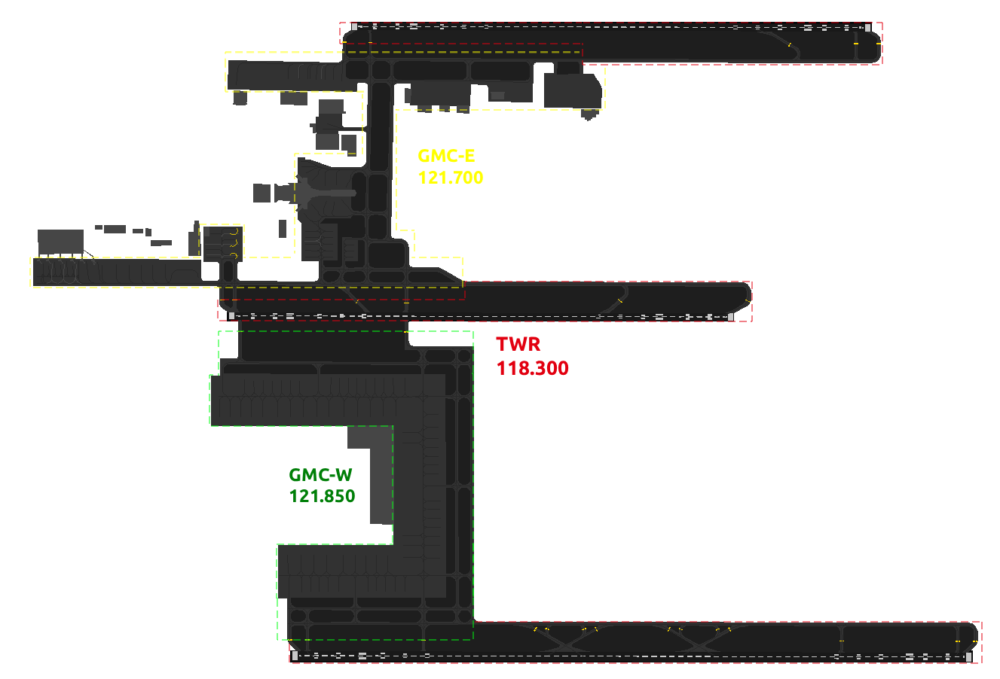
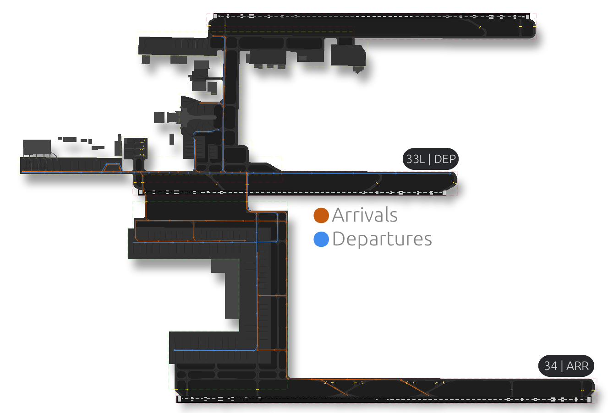

## Kuwait Ground [OKKK_GND]

### Amendment History

| **Revision** | **Effective Date** | **Notes**           |
|--------------|--------------------|---------------------|
| Version 1    | 13AUG25            | Initial Publication |
| Version 2    | 30OCT25            | Revision #1         |

----

## Chapter 1. Position Overview 
**Kuwait Ground (GMC)** is responsible for the movement of aircraft on the airfields aprons and taxiways. The GMC Controller will provide aircraft with pushback instructions when required. Departing Aircraft will then be taxied to the applicable runway holding point and handed off to the TWR Controller as early as possible and clear of any potential ground conflicts. Arriving aircraft will be taxied to a stand on an appropriate apron. 

If the DLV and GMC-W controller is offline, **GMC-E** will act as a bandbox position and assume those responsibilities.

---

  <strong>1.1 - AREA OF RESPONSIBILITY</strong> 

----

## Chapter 2. GEN | Standard Operating Procedures 

### 2.1 Pushback Clearance 
The **GMC Controller** is responsible for providing departing aircraft with a push back clearance. Prior to issuing a push back clearance the aircraft would have correctly set their assigned squawk code. Push back clearance must include the stand number of the aircraft being given clearance. This is method is to ensure other nearby aircraft are aware of the movement from the stand onto a live taxiway. 

Example:

> **GMC Controller:** _**"KAC343, push and start approved facing south on Taxiway W1, runway 33L."**_

Once the push back clearance has been issued the **GMC Controller** should ensure the Departure List is updated accordingly to provide all controllers with additional situational awareness. 

Pushback Clearances must only be issued when it is safe to do so and the area into which the aircraft has been cleared to push to is clear of all obstructions.

#### 2.1.1 Conditional Pushback Clearance 
In some cases you may have an inbound aircraft taxiing to a stand on the apron which passes behind the aircraft on stand requesting push back and start. In order to ensure a constant flow of traffic the **GMC Controller** can provide the aircraft requesting push back and start with a **Conditional Pushback Clearance**. 

Example:

> **GMC Controller:** _**"OMA647, behind the Jazeera Airbus A320 Neo passing from your right to left, push and start is approved facing south on Taxiway W17, runway 33L."**_

#### 2.1.2 Simultaneous Pushback Operations
**Simultaneous Pushback Operations** can be conducted at Kuwait. The aim of this process is that once both aircraft have completed their pushback procedures, they will be in position on the active taxiway with at least one stand between them. 
If aircraft are on adjacent stands and both requesting push back and start it is best practice having each aircraft push in opposite directions to ensure no ground collision will take place. 

### 2.2 Taxi Procedures

#### 2.2.1 Northern Config

  <strong>Diagram</strong> 

#### 2.2.1.1 RWY33L Departure Configuration
Aircraft will be taxied out from their respective apron at the most convenient point and taxied to the holding point for RWY33L, full length. It is imperative the **GMC Controller** has complete situational awareness when taxiing aircraft in Kuwait as there are multiple aprons and terminals.

- Aircraft taxiing from Terminal 4 will be instructed to taxi via W1 to holding point RWY33L.
- Aircraft taxiing from Terminal 1 or Terminal 5 will be instructed to taxi via the appropriate Apron Exit point onto W1 or W14 followed W1.
- Aircraft taxiing from anywhere East of Terminal 5 shall be instructed to taxi via the appropriate Apron Exit point onto E9, followed by W14 and to hold short of Taxiway W1, they can then be given further instructions approaching W1.

Example 1:
> **GMC Controller:** _**"JZR263, taxi to holding point RWY33L via W17, W14, and W1, QNH 1013."**_

Example 2:

> **GMC Controller:** _**"JZR263, taxi via E10, E9, W14 hold short of taxiway W1, QNH 1013."**_

Once approaching W1 and the traffic situation is clear

> **GMC Controller:** _**"JZR263, continue taxi via W1 holding point RWY33L"**_

#### 2.2.1.2 RWY33L Departure Configuration
Aircraft landing on RWY34 will be expected to vacate the runway at V6, TWR will not immediately hand over the aircraft to the GMC Controller to prevent aircraft holding after vacating and potentially blocking the preferential exit point further leading to the runway being obstructed. Aircraft will initially be told to turn left on V by the TWR Controller and then contact the appropriate GMC Controller.

Once the aircraft has been transferred to the appropriate GMC Controller by TWR it is then the responsibility of GMC to safely and efficiently move the aircraft from the taxiway to his assigned stand taken into consideration the situation on the ground.

---

#### 2.2.2 Southern Config

  <strong>Diagram</strong> 

#### 2.2.2.1 RWY15R Departure Configuration
Aircraft will be taxied out from their respective apron at the most convenient point and taxied to the holding point for RWY15R, full length. It is imperative the **GMC Controller** has complete situational awareness when taxiing aircraft in Kuwait as there are multiple aprons and terminals.

- Aircraft taxiing from Terminal 4 will be instructed to taxi via W1 for holding point RWY15R.
- Aircraft taxiing from Terminal 1 or Terminal 5 will be instructed to taxi via the appropriate Apron Exit point onto W14 or W1, then given to taxi via W1 for the holding point RWY15R.
- Aircraft taxiing from anywhere East of Terminal 5 shall be instructed to taxi via E1, E9, W14 and to hold short of taxiway W1, once approaching W1 they can then be given further instructions to taxi to holding point RWY15R.

Example 1:
> **GMC Controller:** _**"KAC343, taxi to holding point RWY15R via W1, QNH 1013."**_

Example 2:
> **GMC Controller:** _**"JZR263, taxi via W17, W14, hold short of taxiway W1, QNH 1013."**_

Once approaching W1 and the traffic situation is clear

> **GMC Controller:** _**"JZR263, continue taxi via W1 holding point RWY15R"**_

#### 2.2.2.2 RWY16 Arrival Configuration
Aircraft landing on RWY16 will be expected to vacate the runway at V5, TWR will not immediately hand over the aircraft to the GMC Controller to prevent aircraft holding after vacating and potentially blocking the preferential exit point further leading to the runway being obstructed. Aircraft will initially be told to turn left on V by the TWR Controller and then contact the appropriate GMC Controller.

Once the aircraft has been transferred to the appropriate GMC Controller by TWR it is then the responsibility of GMC to safely and efficiently move the aircraft from the taxiway to his assigned stand taken into consideration the situation on the ground.

---

#### 2.2.3 Intersection Departures
Intersection Departures can be utilised when the pilot requests it specifically. The GMC Controller is not allowed to instruct an intersection departure to a pilot without it being requested. 

| **Runway** | **Intersections** |
|------------|-------------------|
| 33R        | E2                |
| 33L        | W2                |
| 15R        | W5, W4 & M14      |
| 34         | V3                |
| 16         | V8                |

There are no intersections departures available from RWY15L. 

#### 2.2.4 Arrival Taxi Procedures 

| **Runway** | **Preferred Vacate Point** |
|------------|----------------------------|
| 33R        | Loop 1/2                   |
| 33L        | W5 / End of the Runway     |
| 15R        | W5 / End of the Runway     |
| 15L        | E2, Loop 1/2               |
| 34         | V4/V6                      |
| 16         | V7/V5                      |

#### 2.2.4.1 RWY15R Arrival Configuration 
Aircraft landing on RWY15R will be expected to vacate the runway at W2, TWR will not immediately hand over the aircraft to the GMC Controller to prevent aircraft holding after vacating and potentially blocking the preferential exit point further leading to the runway being obstructed. Aircraft will initially be told to turn left on W1 by the TWR Controller and then contact the GMC Controller. 

Once the aircraft has been transferred to the GMC Controller by TWR it is then the responsibility of GMC to safely and efficiently move the aircraft from the taxiway to his assigned stand taken into consideration the situation on the ground.

#### 2.2.5 Conditional Taxi Instructions 
In some cases aircraft may require a **Conditional Taxi Instruction** in order to facilitate for other movements on the ground and to ensure the safe movement of aircraft. 

#### 2.2.5.1 Conditional Departure Taxi Instructions 
If the taxi route for a departing aircraft is not clear you can give them a conditional clearance to stop at a certain point along their taxi route to ensure they remain clear of any conflict. 

> **GMC Controller:** _**"MSR621, taxi via W17 and W14 hold short of Taxiway W1, give way to the Kuwaiti Boeing 777 at W1."**_

Once the route has cleared then they can be given the remainder of their taxi instructions as per normal standard operating procedures outlined in Chapter 2.2

#### 2.2.5.2 Conditional Arrival Taxi Instructions 
Like before, if an arriving aircraft does not have a clear route to their stand after vacating the runway a conditional clearance can be issued to ensure smooth flow of traffic in and out of the airfield. 
If issuing a conditional arrival taxi instruction you can provide the aircraft with their expected stand number. 

> **GMC Controller:** _**"KAC418, Expect Stand 72 taxi via E9, W14, hold short of Taxiway W1, give way to the company Airbus A320 Neo at W1."**_

### 2.3 Low Visibility Procedures (LVPs)

At Kuwait International Airport, LVP  be declared when Runway Visual Range (RVR) falls below operational thresholds or when movement areas are not visible from the control tower. However, on VATSIM, we rely on the RVR reading to determine when we apply Low Visibility Procedures. 

LVP must be applied when the RVR drops below **550 meters** or visibility drops below 800 meters.

#### 2.3.1 Low Visibility Procedures - Departures

During LVPs, intersection departures are not authorised for all runways. 

Departures are permitted under LVP conditions **only** where the RVR is not less than 150 meters.

#### 2.3.2 Low Visibility Procedures - Arrivals 

| **Runway** |   **Vacate Point**   |
|:----------:|:--------------------:|
|   RWY15L   | E2 / Loop 1 / Loop 2 |
|   RWY15R   |      W2 / Loop 1     |
|   RWY33R   |    Loop 1 / Loop 2   |
|   RWY33L   |      W5 / Loop       |
|   RWY34    | V4/V6                |
|   RWY16    | V7/V5                |

### 2.4 Stand Allocation

| **Apron**             | **Stand Numbers** | **Airlines**                                        |
|-----------------------|-------------------|-----------------------------------------------------|
| Western Apron (East)  | B1-B2 / 1-5       | Jazeera / All Other Airlines                        |
| Western Apron (West)  | 21 - 139          | Jazeera / All Other Airlines                        |
| Eastern Apron         | 40 - 46           | Jazeera                                             |
| GA Apron              | G1 - G29B         | Business Jets                                       |
| Cargo City            | 501 - 554         | DHX / QTR Cargo / Emirates Cargo / Cargolux / Atlas |
| Cargo City (Military) | 533-580           | Military use                                        |
| Terminal 4            | 63 - 79           | Kuwait Airways                                      |
| Emiri Terminal        | R1 - R8           | Kuwait Emiri Flights                                |
