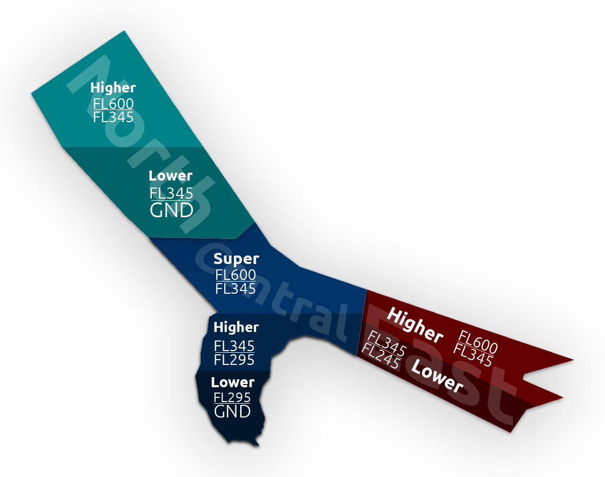

## [1] Airspace

### Bahrain Radar 1 [OBBB_1]

### Bahrain Radar 2 [OBBB_2]
#### Bahrain East [OBBB_E]

### Bahrain Radar 3 [OBBB_3]
#### Bahrain North [OBBB_N]

### Bahrain Central Higher [OBBB_CH]
#### Bahrain Central Lower [OBBB_CL]

[2] Area of Responsibility 

[3] LOA Descends 

