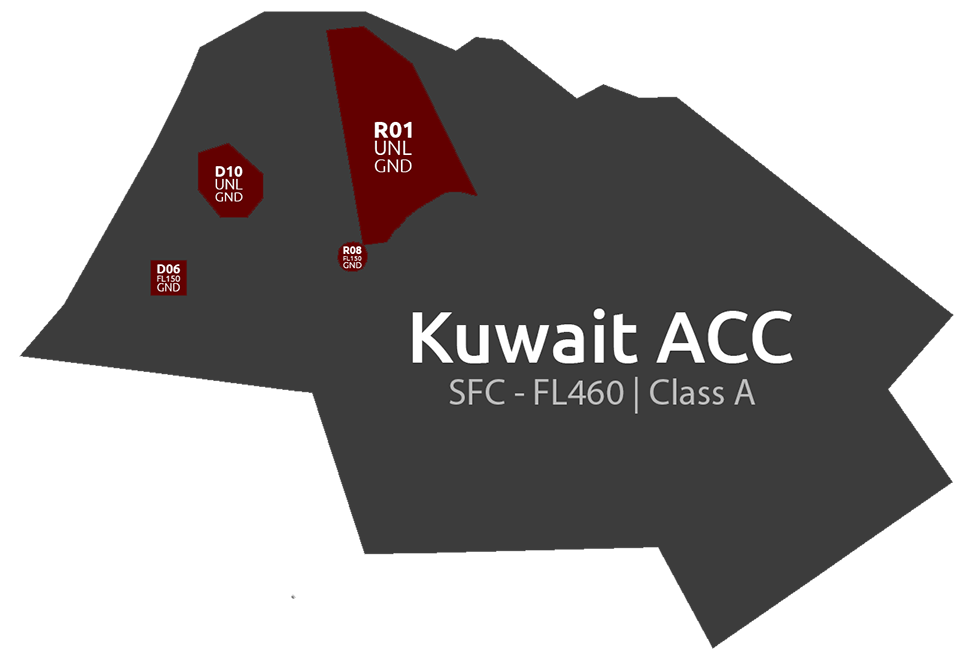
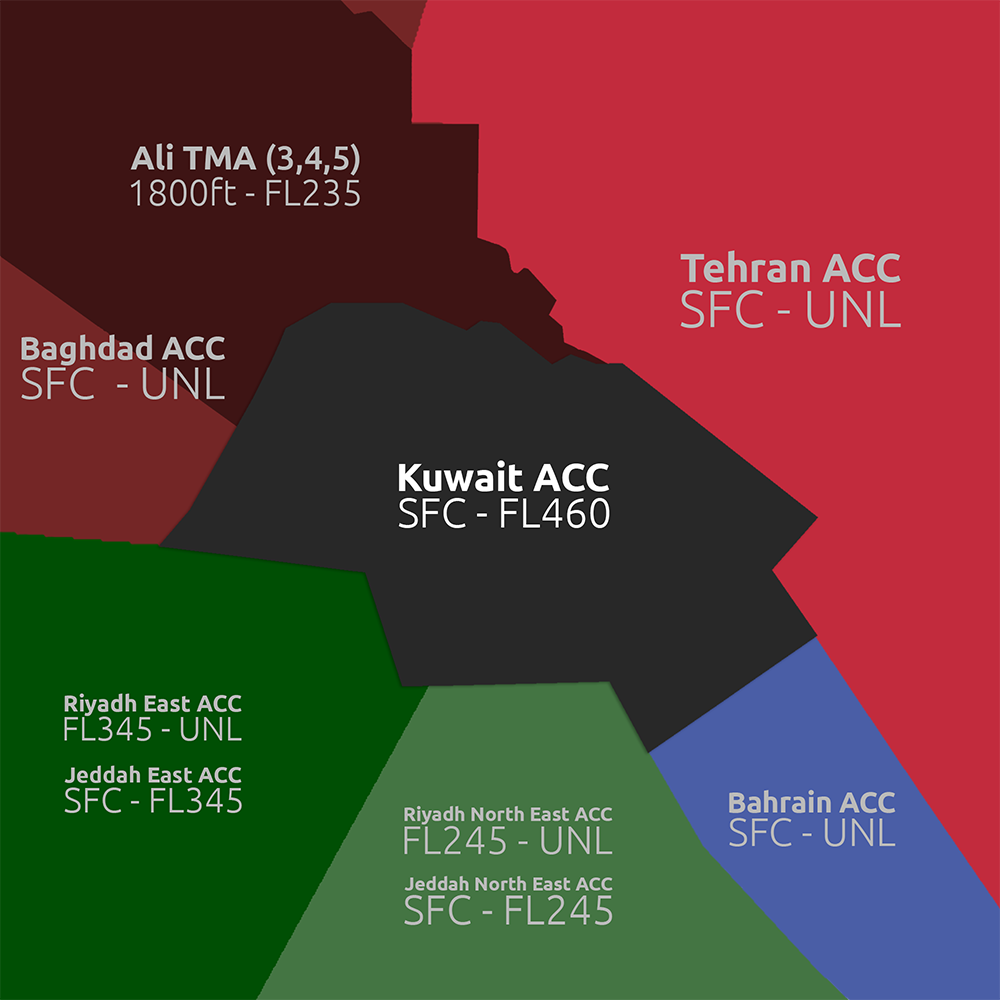

## Sectors 

### Position Callsigns
| **Positions** | **Sector**   | **Frequency** |
|---------------|--------------|---------------|
| OKAC_CTR      | Kuwait Radar | 125.300       |
| OKAC_U_CTR    | Kuwait Upper | 132.100       |     |

### Surrounding Airspace

### LOA Descends

| Waypoint | Descent Level | Responsible Sectors | Destination | Extra notes                  |
|----------|---------------|---------------------|-------------|------------------------------|
| TASMI    | 10000ft       | OKAC/ORBB           | ORMM        |                              |
| LONOS    | FL310         | OKAC/OBBB           | OBBI        | Fl330 or below (coordinated) |
| KUMBO    | FL220         | OBBB/OKAC           | OKKK        | FL220                        |
| SIDAD    | FL170         | ORBB/OKAC           | OKKK        | Descents given by ORBB       |

---

### Kuwait Radar

**OKAC_CTR** is used as the primary bandbox position in the OKAC FIR. It controls OKKK (Kuwait International Airport), at utilises runways 33L, 33R, 15L, and 15R. 

**Traffic arriving into OBBI**: The stream landing in Bahrain will be handed off from Kuwait Radar to Bahrain North Lower (OBBB_N_CTR), who must ensure that traffic **reach waypoint LONOS at FL330 or below** (although it is preferred to keep them at or below FL310 on an odd level). Our COPX altitudes on the sector files are added for your convienence.

---

#### Transiting to the OBBB FIR

With this CTL Edition, we will have three streams using the **OKAC** FIR going to **OMAA**, entering the OMAE FIR. The departure airports are mentioned below:

- LTFM-OMAA
- LDDU-OMAA
- LPPT-OMAA

Please note that these transiting aircraft are to be transfered to **OBBB_3_CTR** and not the **North** callsign. The MIT (Minimum in Trail is 10NM entering the next FIR, in the case where this is not possible, coordination must happen with the next FIR controller.)

---

### Sector File Installation

To install our latest sectorfile, which is mandatory, please head to [Aeronav](https://files.aero-nav.com/OKAC) and download the latest published sectorfile. 

- We utilise **vATIS** to set up our ATIS information. If at all, you are not familiar on how to utilise this software, it is your responsibility to message a member of Staff within Khaleej for assistance. Once downloaded, open the file and head to the 'Plugins' folder --> 'vATIS Profiles'. 
- Follow this video for further assitance: [Tutorial](https://www.youtube.com/watch?v=MlV7Lu5gzgk)
