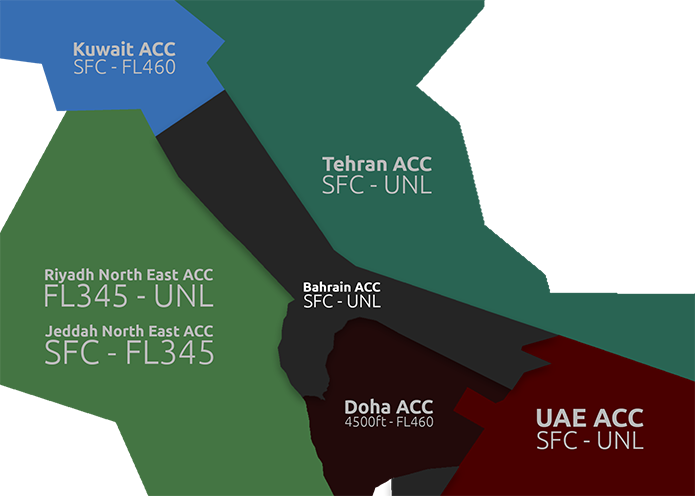

## Sectors

  <strong>SECTOR DIAGRAM</strong> 

| **Position** | **Sector** | **Frequency** |
|--------------|-------------------|-------------------------|
| OKAC_U_CTR        | Kuwait Upper             | 127.525                |
| OKAC_CTR        | Kuwait Radar             | 125.300              |

## Surrounding Airspaces

  <strong>Bahrain ACC</strong> 

  <strong>Bahrain TMA</strong> 

## LOA Descends

